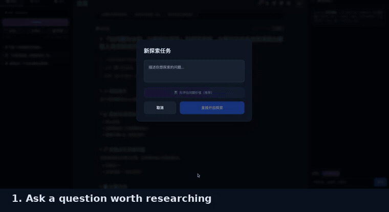

# 🧭 HiExplore

[](./LICENSE)
[](https://www.hiexplore.com/)
[](https://github.com/chenhaiyan123/ai-auto-explorer)

**English** | [中文](./README.zh-CN.md) | [Hosted version](https://www.hiexplore.com/)

### Score whether a question is worth researching — before you research it.

Every AI tool is racing to answer questions better. None of them ask whether the question deserved an answer in the first place.

HiExplore starts one step earlier. You put candidate questions on a board, it scores each one across six dimensions, and only the ones that survive get promoted into long-running research projects — where a team of specialized agents works on them over days and weeks, producing plain Markdown you own.

**Who it's for:** independent researchers, creators, and indie developers (low-friction curiosity → ongoing research), plus people doing intelligence/research work (hang a question up, get continuous, traceable investigation).



---

## ⚔️ Why it's different from generic AI search / Deep Research

| | Generic AI search / Deep Research | HiExplore |
|---|---|---|
| **Question value gate** | ❌ answers everything, no questions asked | ✅ QVS 6-dimension score — below 60, it tells you not to research it yet |
| **Claim reliability** | looks right, never says where it might be wrong | every node requires a falsifiable hypothesis + biggest unknown + supporting/opposing evidence |
| **Reasoning vs real-world evidence** | blended | strictly separated; low-confidence reasoning is flagged for human review |
| **Simulation vs reality** | simulation results quoted as facts | simulations explicitly labeled "this is a simulation, not evidence", with a reality check + probe hint |
| **Stuck?** | keeps hallucinating | pushes the question to real humans / real data via a companion phone app |
| **Your data** | platform cloud | your browser / local Markdown, Obsidian-friendly |
| **Models** | locked in | bring your own: DeepSeek, Qwen, Claude, local Ollama |
| **Code** | closed | MIT, self-hostable |

In one line: **others give you answers. HiExplore makes you able to trust the answer.**

---

## 🔥 QVS — Question Value Score

Drop in a question and QVS returns a 0–100 score with a letter grade, a radar breakdown per dimension, and concrete suggestions for sharpening it. Below 60 and the system tells you not to bother yet.


| Dimension | Weight | What it asks |
|---|---|---|
| **Verifiability** | 0.20 | Can the conclusion actually be checked, or is it unfalsifiable? |
| **Depth** | 0.20 | Does it go three layers down, or bottom out in one sentence? |
| **Scarcity** | 0.15 | Has this already been answered to death? |
| **Social value** | 0.15 | Does anyone besides you care about the answer? |
| **Innovation** | 0.15 | A genuinely new angle, or a rehash? |
| **Feasibility** | 0.15 | Reachable with the resources you actually have? |

Two questions, same topic:

> ❌ *"Will AI replace programmers?"* — unfalsifiable, answered a thousand times, no way to know you were right.
>
> ✅ *"Across 3 real codebases, how did Copilot change median PR review time and defect escape rate?"* — checkable, specific, nobody has published it.

Most "this seems interesting" questions die on **verifiability** and **feasibility**. That's the point — finding out costs you 10 seconds instead of three weeks.

> The six weights above are a judgment call, not an empirical result. If you have a better answer, [open an issue](https://github.com/chenhaiyan123/ai-auto-explorer/issues) — this is the part of the project I most want torn apart.

---

## What happens after a question passes

**🤝 An agent team assembles.** The system reads the goal, splits it into 5–8 key directions, groups them into work areas (market research / engineering / …), and assigns a specialized agent to each. There's a group chat on the right: @mention a member, `[[reference]]` any note into context, append any reply straight into a note.

**🎯 Falsifiability is enforced.** Every node must carry a one-line hypothesis reality could disprove, plus the biggest unknown and the supporting/opposing evidence. Reasoning-level claims are kept separate from real-world evidence.

**🧪 Simulations know their place.** Agents can write and run simulations (state variables, recurrence, key readings) — but every simulation is explicitly labeled *"this is a simulation, not evidence"*, and must state what's unreliable about the model and how to check reality instead.

**📱 Reality feedback loop.** When the AI hits a question only the real world can answer, it's pushed to real humans through a companion phone app (PWA) — answers flow back into the question tree. Optional: register HTTP-API lab devices (sensors, robot arms) and agents can read from and act on them mid-exploration, with an auditable call log.

**🤖 It keeps running with the UI closed.** A local daemon loops *pick frontier → decompose → execute → review → record → propose new directions*, with a daily budget and rate limits. Low-confidence conclusions are flagged **needs human review** rather than silently written in as fact — AI does the grinding, you make the calls.

**📓 Output is plain Markdown you own.** Project-as-folder structure, `[[bidirectional links]]`, a navigable knowledge graph. Export a note, export the whole vault as a zip, or write straight into a local folder (Obsidian-style). Everything lives in your browser and your filesystem.

**🧠 You bring the model.** No built-in backend, no API key of ours:
- **Local** — Ollama, LM Studio, vLLM. Data never leaves your machine.
- **Cloud** — any OpenAI-compatible endpoint (DeepSeek, Qwen, Claude…).
- **Self-hosted proxy** — keep your key behind a serverless function (`server/fc_backend.js`).

---

## 🚀 Quick start

```bash
git clone https://github.com/chenhaiyan123/ai-auto-explorer.git
cd ai-auto-explorer
npm install
npm run dev        # http://localhost:3000
```

Open **⚙️ Settings → Model**, pick a preset, done. No backend, no signup.

Don't want to self-host? [Try the hosted version](https://www.hiexplore.com/) — free, no signup required.

| Setup | Provider | API Base URL | Model |
|---|---|---|---|
| Local, free | OpenAI-compatible | `http://localhost:11434/v1` | `qwen2.5:7b` |
| Best value | OpenAI-compatible | `https://api.deepseek.com/v1` | `deepseek-chat` |
| Strongest | OpenAI-compatible | `https://api.anthropic.com/v1` | `claude-sonnet-4-6` |

### Desktop app

Recommended when using local models — no CORS or mixed-content limits when reaching Ollama or LAN devices.

```bash
npm run app          # build + launch
npm run app:dist     # package .dmg / .exe / .AppImage into release/
```

### 24/7 autonomous daemon

```bash
cp server/explorer.config.example.json server/explorer.config.json   # model + your question
npm run explore
# or: node server/explorer-daemon.mjs "the question you want researched long-term"
# Ctrl+C saves state and resumes next time
```

Output lands in `explorer-vault/`: `project.json` (full state), one `.md` per node with self-rated confidence, and `explorer.log`. Open it in HiExplore or Obsidian.

> On local models, raise `intervalSec` and stay light (`qwen2.5:7b`/`14b`) — 35B tends to time out.

---

## 🏗️ Stack

React 19 + TypeScript + Vite + Tailwind + D3. Pure front-end, zero backend dependency, static build.

```
services/
├── qvsService.ts        # QVS — 6-dimension question scoring
├── teamService.ts       # agent team assembly + direction decomposition
├── dashboardService.ts  # project rollup (pure functions)
├── llmProvider.ts       # unified model layer (OpenAI-compatible / proxy)
├── noteLinks.ts         # bidirectional links / backlinks
└── vault.ts             # Markdown import / export / local vault
```

`npm run build` → static `dist/`, deployable anywhere. A GitHub Pages workflow is included.

## 🤝 Contributing

Issues and PRs welcome — especially **QVS dimension and weight proposals**, agent/exploration templates, IoT device adapters, and model presets. Discussion lives in [Discussions](https://github.com/chenhaiyan123/ai-auto-explorer/discussions). See [CONTRIBUTING.md](./CONTRIBUTING.md).

## 📄 License

[MIT](./LICENSE)
