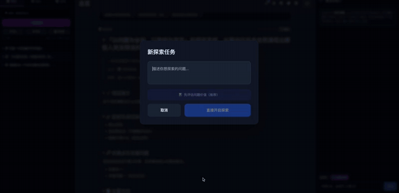
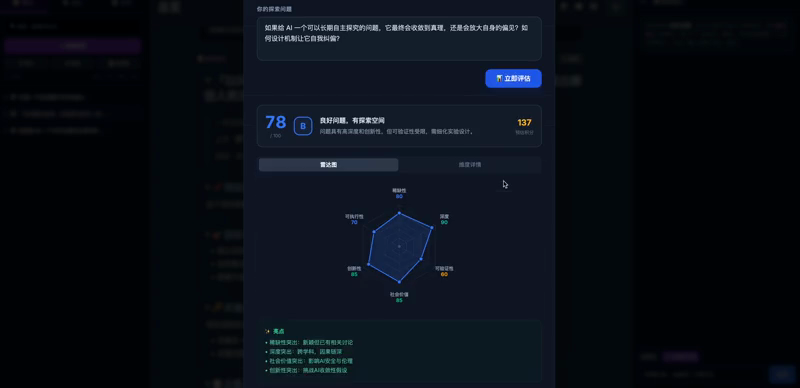

# 🧭 HiExplore · AI 自动探究平台

[English](./README.md) | **中文**

### 先算清楚这个问题值不值得研究，再让 AI 去研究。

所有 AI 工具都在抢着把问题答得更好，没有一个先问一句：这个问题配得上你的时间吗？

HiExplore 从上游一步开始。你把候选问题丢进问题广场，它按六个维度打分，只有活下来的问题才会被立项——然后一支分工明确的 Agent 团队围着它长期跑，产出是归你所有的纯 Markdown。

**适合谁：** 独立研究者 / 创作者 / 独立开发者（低门槛地把好奇心变成持续探究），以及做情报调研、尽职调查的人（把一个问题挂上去，得到持续、可溯源的调查）。



---

## 🔥 QVS · 问题价值评估

丢进一个问题，QVS 返回 0–100 的总分、S/A/B/C/D 等级、六维雷达图拆解，以及把问题改锋利的具体建议。低于 60 分，它会直接告诉你：现在还不值得投入。



| 维度 | 权重 | 它在问什么 |
|---|---|---|
| **可验证性** | 0.20 | 结论能不能被检验，还是根本证伪不了？ |
| **深度** | 0.20 | 能不能往下挖三层，还是一句话就到底？ |
| **稀缺性** | 0.15 | 是不是已经被人回答烂了？ |
| **社会价值** | 0.15 | 除了你自己，还有谁在乎这个答案？ |
| **创新性** | 0.15 | 是真的新角度，还是老调重弹？ |
| **可执行性** | 0.15 | 以你手上真实的资源，够得着吗？ |

同一个话题，两种问法：

> ❌ 「AI 会不会取代程序员？」—— 证伪不了，被答过一千遍，你也永远不知道自己对没对。
>
> ✅ 「在 3 个真实代码库里，Copilot 让 PR review 时长中位数和缺陷逃逸率各变化了多少？」—— 可检验、够具体、没人发表过。

你脑子里那些「好像挺有意思」的问题，大部分会死在**可验证性**和**可执行性**上。这正是重点——花 10 秒钟知道，比花三周之后才知道划算。

> 上面六个权重是我拍脑袋定的，没有实证依据。你有更好的答案，欢迎[开个 issue](https://github.com/chenhaiyan123/ai-auto-explorer/issues) —— 这是整个项目里我最想被人挑战的部分。

---

## ✨ 问题通过之后

**🗂️ 项目即文件夹（像代码仓库的工程笔记）**
一个项目就是一个文件夹，自带 `README` 和 `总览` 主文件。项目分解为 5–8 个关键节点（二级），每个节点内部还能再开三级详情。左侧是可缩进、可折叠的笔记树，所有笔记都能折叠收起，长内容也按标题折叠成大纲，不再是一面墙的字。

**🔗 双向链接 + 知识图谱**
在任意笔记正文里用 `[[标题]]` 关联其它笔记，自动形成出链 / 反向链接。点工具栏的「🕸️ 图谱」弹出关系网络：纵向是层级、横向是关联，一眼看清问题之间的脉络。

**🤝 AI 组建团队 + 团队群聊**
点项目上的 🤝，AI 会读懂项目目标 → 拆成 5–8 个关键节点 → 按「工作板块」（市场调研 / 工程制作…）分工 → 给每个方向指派一个专门的 Agent → 可一键让团队开始自动探索。右侧是与团队的群聊：@某个成员单独发言、`[[引用]]` 任意笔记进上下文、把 AI 的产出一键「补充到笔记」。

**🔥 问题广场（QVS 打分的入口）**
像知乎一样收集候选问题，用上面那套 QVS 打分排序，支持「只看高价值」「关注 / 赞」两套兴趣机制，看中的问题一键「立项」转成项目。内置约 150 个精选种子问题（22 个领域），第一次打开就有东西可玩。

**📓 本地 Markdown 库（你的数据你做主）**
所有内容存在浏览器 localStorage；可把单篇导出 `.md`、整库导出 `.zip`（项目即文件夹的结构）、导入 `.md`，在 Chrome/Edge 里还能直接保存到本地文件夹（Obsidian 式 Vault）。

**🧠 模型自由接入**
所有 AI 能力都走你自己配置的模型，无内置后端：
- 本地：Ollama、LM Studio、vLLM（数据不出本机）
- 云端：任何 OpenAI 兼容 API（DeepSeek、通义千问、Claude…）
- 自部署代理：把 Key 藏在 Serverless 函数后（见 `server/fc_backend.js`）

**🔌 IoT / 实验设备接入**
注册带 HTTP API 的设备（传感器、培养箱、机械臂…），AI 在探索中可自主调用读取数据、执行操作，把物理世界纳入探究闭环，调用有日志可审计。

**🌗 白天 / 深色主题**，顶栏一键切换。

---

## 🚀 快速开始

```bash
git clone https://github.com/chenhaiyan123/ai-auto-explorer.git
cd ai-auto-explorer
npm install
npm run dev        # http://localhost:3000
```

首次进入点右上角 **⚙️ 设置 → 模型接入**，选一个预设填好即可使用，无需任何后端。

### 配置模型（举例）

| 场景 | 接入方式 | API Base URL | 模型名 | 备注 |
|---|---|---|---|---|
| 本地零成本 | OpenAI 兼容 | `http://localhost:11434/v1` | `qwen2.5:7b` | 先 `ollama serve` |
| DeepSeek（推荐性价比） | OpenAI 兼容 | `https://api.deepseek.com/v1` | `deepseek-chat` | 需 DeepSeek Key |
| Claude（更完整） | OpenAI 兼容 | `https://api.anthropic.com/v1` | `claude-sonnet-4-6` | 需 Anthropic Key |

> 提示：模型越强，自动探究的内容越深入、越可靠。顶栏的 🧠 徽标会显示当前正在使用的模型。

---

## 🖥️ 桌面客户端（推荐用本地模型时）

做成桌面应用后，调用本地 Ollama / 局域网 IoT 设备不再受浏览器跨域和混合内容限制，离线本地优先。

```bash
npm install          # 首次会下载 Electron 运行时
npm run app          # 构建并打开 HiExplore 桌面应用
npm run app:dist     # 打包安装包（macOS .dmg / Windows .exe / Linux AppImage），产物在 release/
```

> 开发调试：一个终端 `npm run dev`，另一个终端 `npm run app:dev`（连开发服务器、带热更新）。

---

## 🤖 7×24 自主探索守护进程（真正不间断）

网页/桌面里的探索循环只在打开时跑；想让 AI **关掉界面也持续自我研究**，用这个本地常驻守护进程。它会不停地「选前沿 → 拆解 → 执行 → 评审验证 → 沉淀 → 自主提新方向」，带每日预算和限流，产出可在 HiExplore「本地库/导入」或 Obsidian 里打开的 Markdown。

```bash
cp server/explorer.config.example.json server/explorer.config.json   # 填模型 + 你的研究问题
npm run explore                          # 开始 7×24 自主探索
# 或直接传问题： node server/explorer-daemon.mjs "我想长期研究的问题"
# Ctrl+C 安全停止（自动存盘，下次继续）
```

产出在 `explorer-vault/`：`project.json`（完整状态）、按项目分文件夹的 `*.md`（每个节点一篇，含自评置信度）、`explorer.log`（运行日志）。低置信度的结论会自动标记「待人工复核」，等你来定夺——这就是「AI 干苦活、人做关键决策」。

> 配套建议：本地用 Ollama 时把 `intervalSec` 调大、模型选轻一点（如 `qwen2.5:7b`/`14b`），35B 偏慢容易超时。

---

## 🔐 托管版登录（可选 · 仅 SaaS 需要）

开源/本地版**不需要登录**，直接用。只有托管版（www.hiexplore.com）做用户体系时才用到——目前支持**邮箱验证码登录**：

```bash
# 后端（零额外依赖，复用 express）
RESEND_API_KEY=你的Resend密钥 MAIL_FROM="HiExplore <noreply@hiexplore.com>" AUTH_SECRET=随机长串 npm run auth
# 前端构建时设置后端地址即可启用真实登录；不设则保持免登录
VITE_AUTH_API=https://api.hiexplore.com npm run build
```

不配 `RESEND_API_KEY` 时验证码会打印到后端控制台（方便本地联调）。手机号 / 微信扫码需各自的第三方账号与资质，后续接入。

---

## 🏗️ 技术栈

React 19 + TypeScript + Vite + Tailwind + D3，纯前端，零后端依赖，数据保存在浏览器与本地文件。

```
├── App.tsx                # 主应用
├── components/            # NotesPanel(项目树) / NodeDetails(笔记) / TeamChat(团队群聊)
│                          # QuestionBoard(问题广场) / GraphVisualization(图谱) / ...
├── services/
│   ├── noteLinks.ts       # 双向链接 / 反链 / 关联边
│   ├── vault.ts           # Markdown 导入导出 / 本地库
│   ├── teamService.ts     # AI 组建团队（拆方向 + 指派 Agent）
│   ├── qvsService.ts      # 问题价值评估（6 维）
│   ├── llmProvider.ts     # 统一模型接入层（OpenAI 兼容 / 云代理）
│   ├── geminiService.ts   # 探索 / 对话核心调用
│   └── ...
├── server/                # 可选参考后端（留言板 / Serverless 代理），非前端必需
└── docs/                  # 部署等文档
```

构建：`npm run build`，产物在 `dist/`，可托管到任何静态站点（GitHub Pages / Vercel / OSS）。仓库已内置 GitHub Pages 部署工作流（`.github/workflows/deploy.yml`）。

---

## 🤝 贡献

欢迎 Issue 与 PR，尤其欢迎：新的 IoT 设备适配、Agent / 探索模板、QVS 维度改进、模型预设。详见 [CONTRIBUTING.md](./CONTRIBUTING.md)。

## 📄 License

[MIT](./LICENSE)
